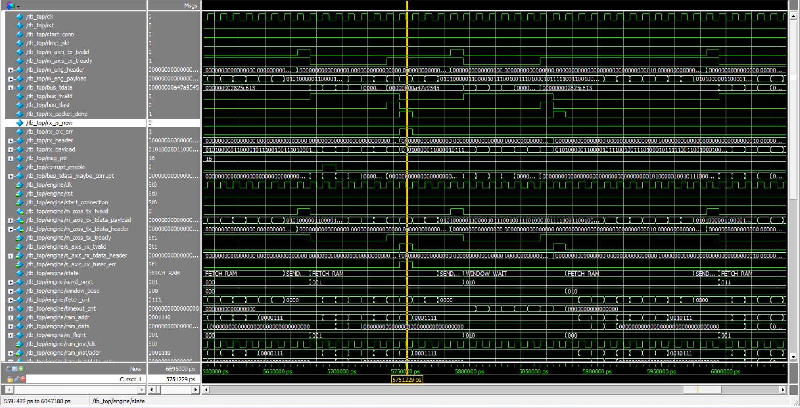
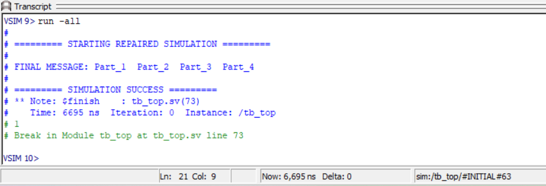

# TCP Sliding Window & CRC-32 Engine (SystemVerilog)

This repository contains a RTL implementation of a reliable transport layer engine using a Sliding Window protocol (W=2). The design focuses on hardware-efficient error recovery and packet framing for FPGA-based networking applications.

## Technical Specifications
* **Protocol:** Sliding Window with Go-Back-N (GBN) retransmission.
* **Error Detection:** 32-bit CRC (Polynomial: 0xEDB88320) processed combinatorially per packet.
* **Flow Control:** Hardware FSM managing sequence numbers (0-3) and ACK tracking.
* **Handshake:** Three-way handshake (SYN/ACK) state machine logic.
* **Throughput:** AXI-Stream compatible data bus (64-bit segments).

## System Architecture
The design is partitioned into modular RTL units:
* `tcp_engine.sv`: Main Control FSM (Handles timeouts and window base pointer).
* `packet_sender/receiver.sv`: Encapsulation/Decapsulation logic with integrated CRC check.
* `crc32_calc.sv`: Parallel CRC calculation (IEEE 802.3 standard).

## Simulation & Verification
Verified using ModelSim Intel FPGA Edition. The testbench (`tb_top.sv`) includes a fault-injection layer to validate reliability.

**Observed behavior in simulation:**
* **Packet Loss:** Successfully detected ACK timeout at T=3305ns; triggered Go-Back-N from Segment 0.
* **Bit Corruption:** Injected 0xDEAD error into the bus; `packet_receiver` correctly flagged `CRC ERROR` and requested retransmission.
* **Data Integrity:** Final reassembled message: `Part_1 Part_2 Part_3 Part_4`.

### Final Reconstructed Output
The image below shows the testbench successfully reassembling the interleaved TCP segments into the final message:

